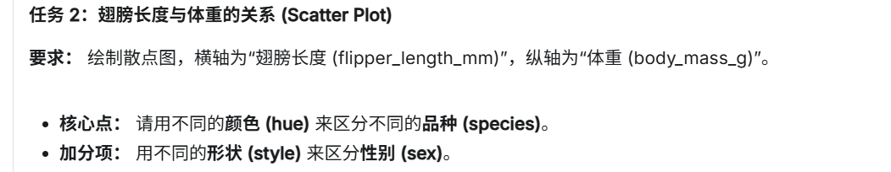
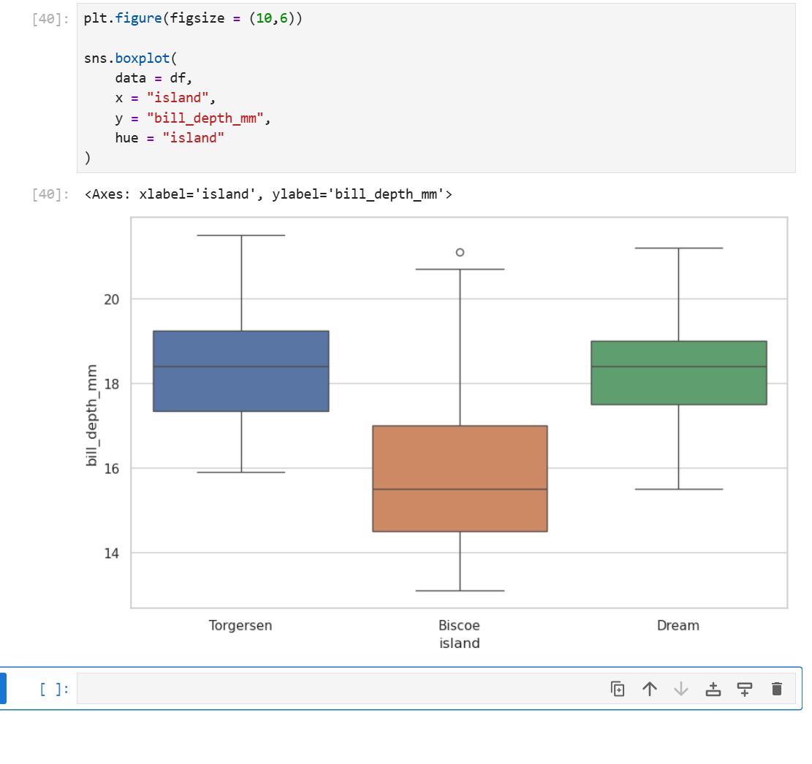

## 如何利用一列数值类特征绘制直方图

绘制直方图（Histogram）是探索数值型数据分布特征（如偏态、峰度、离群点）最常用的方法。

根据你使用的工具不同（Python、Excel 等），有以下几种主要实现方式：

---

### 方法一：使用 Python - Pandas（最简单）
如果你已经将数据读入为 DataFrame，直接调用 `.hist()` 方法即可。

```python
import pandas as pd
import matplotlib.pyplot as plt

# 假设 df 是你的数据表，'score' 是数值列
df = pd.DataFrame({'score': [10, 22, 25, 35, 42, 48, 50, 55, 60, 80]})

# 绘制直方图
df['score'].hist(bins=10, color='skyblue', edgecolor='black')

plt.title('Score Distribution')
plt.xlabel('Value')
plt.ylabel('Frequency')
plt.show()
```

---

### 方法二：使用 Python - Seaborn（最美观）
Seaborn 提供了更高级的统计图表，并可以轻松叠加密度曲线（KDE）。

```python
import seaborn as sns
import matplotlib.pyplot as plt

# 模拟数据
data = [10, 22, 25, 35, 42, 48, 50, 55, 60, 80]

# kde=True 会绘制核密度估计曲线
sns.histplot(data, bins=10, kde=True, color="teal")

plt.show()
```

---

### 方法三：使用 Python - Matplotlib（底层控制）
如果你需要更精细地控制图表的每一个细节：

```python
import matplotlib.pyplot as plt

data = [10, 22, 25, 35, 42, 48, 50, 55, 60, 80]

plt.hist(data, bins=5, range=(0, 100), color='orange', alpha=0.7)
plt.grid(axis='y', alpha=0.3)
plt.show()
```

---

### 方法四：使用 Excel（无需编程）
1.  **选中**你的那一列数值数据。
2.  点击顶部菜单栏的 **“插入” (Insert)**。
3.  找到 **“统计图表”图标**（通常看起来像几根蓝色的柱子）。
4.  选择 **“直方图” (Histogram)**。
5.  *进阶：* 右键点击横坐标轴，选择“设置坐标轴格式”，可以手动调整“箱宽”（Bin width）或“箱数”（Number of bins）。

---

### 绘制直方图的核心参数（避坑指南）

无论用什么工具，调整以下两个参数对结果影响最大：

1.  **Bins（箱数/组数）：**
    *   **太少：** 会掩盖数据的细节（比如原本有两个峰，看起来只剩一个）。
    *   **太多：** 会让图表变得极其琐碎，受噪声影响大，看不出整体趋势。
    *   *经验法则：* 常见的默认值是 10-30，或者使用斯特格斯公式（Sturges' Rule）计算。

2.  **Range（范围）：**
    *   有时候数据中存在极端的离群点（Outliers），会导致主体部分被压缩得很小。此时可以手动设置 `range` 过滤掉极端值。

3.  **Density（密度 vs 频数）：**
    *   **频数（Frequency）：** 纵轴显示落在该区间的样本数量。
    *   **密度（Density）：** 纵轴显示概率密度，使直方图的总面积等于 1，适合用来和标准分布（如正态分布曲线）对比。

### 总结
*   如果你在做数据清洗：**Pandas** 最快。
*   如果你在写数据报告：**Seaborn** 最漂亮。
*   如果你不需要写代码：**Excel** 最直接。


## 如何完成这一任务？

这个任务非常适合使用 Python 的 **Seaborn** 库来完成。Seaborn 是基于 Matplotlib 的高级绘图库，它的 `scatterplot` 函数可以直接通过参数 `hue` 和 `style` 来实现你图片中的所有要求。

以下是完成该任务的完整代码：

```python
import seaborn as sns
import matplotlib.pyplot as plt

# 1. 加载数据 (假设你使用的是经典的 Palmer Penguins 数据集)
# 如果你已经有了 DataFrame，请跳过这一步并改用你的变量名
penguins = sns.load_dataset("penguins")

# 2. 设置绘图风格 (可选，让图表更美观)
sns.set_theme(style="whitegrid")

# 3. 创建散点图
plt.figure(figsize=(10, 6)) # 设置画布大小

sns.scatterplot(
    data=penguins, 
    x="flipper_length_mm",  # 横轴：翅膀长度
    y="body_mass_g",        # 纵轴：体重
    hue="species",          # 核心点：用不同颜色区分品种
    style="sex",            # 加分项：用不同形状区分性别
    s=100,                  # 设置点的大小，让它更清晰
    alpha=0.7               # 设置透明度，防止点太多重叠看不清
)

# 4. 添加标题和标签
plt.title("Relationship between Flipper Length and Body Mass", fontsize=15)
plt.xlabel("Flipper Length (mm)", fontsize=12)
plt.ylabel("Body Mass (g)", fontsize=12)

# 5. 显示图表
plt.legend(bbox_to_anchor=(1.05, 1), loc='upper left') # 将图例放在外面防止遮挡
plt.tight_layout()
plt.show()
```

### 代码要点解析：

1.  **`x="flipper_length_mm"` 和 `y="body_mass_g"`**: 这两行直接对应了你任务中的横轴和纵轴要求。
2.  **`hue="species"`**: 这是 Seaborn 的强大之处。只需这一行，它就会自动为不同的品种（Adelie, Chinstrap, Gentoo）分配不同的颜色，并自动生成颜色对照表（图例）。
3.  **`style="sex"`**: 对应加分项。它会将同一个品种的数据进一步细分。例如：雄性可能显示为“X”，雌性显示为“O”。
4.  **`sns.load_dataset("penguins")`**: 任务中的字段名（`flipper_length_mm`, `body_mass_g` 等）来源于数据科学中非常著名的 **Palmer Penguins（帕尔默企鹅）** 数据集。如果你是在做作业，通常老师会提供这个 CSV 文件或要求你从 seaborn 内置库加载。

### 如果你使用的是本地 CSV 文件：
如果你的数据在本地电脑上，第一步需要改为：
```python
import pandas as pd
df = pd.read_csv("你的文件名.csv")
# 然后把上面代码中的 data=penguins 改为 data=df
```

通过这段代码，你不仅能完成基础任务，还能完美拿到“加分项”的分数。


## 如何在箱线图上叠加一层抖动散点图，以便看到数据点分布？

要在箱线图（Boxplot）上叠加一层“抖动散点图”，最常用的方法是使用 Seaborn 库中的 **`sns.stripplot`**。

你只需要在原有的代码后面紧接着调用 `stripplot` 即可。由于它们共享同一个 `plt.figure` 画布，Seaborn 会自动将它们重叠在一起。

以下是修改后的代码：

```python
plt.figure(figsize=(10, 6))

# 1. 绘制底层的箱线图
sns.boxplot(
    data=df, 
    x="island", 
    y="bill_depth_mm", 
    hue="island",
    palette="pastel"  # 建议给箱线图用浅色
)

# 2. 叠加抖动散点图
sns.stripplot(
    data=df, 
    x="island", 
    y="bill_depth_mm", 
    color="black",    # 散点建议使用深色（如黑色或深灰色）以突出对比
    alpha=0.4,        # 设置透明度，避免点太密集遮挡箱线图
    jitter=True,      # 关键：开启抖动，使点不重合
    dodge=False,      # 因为 x 和 hue 是一样的，设为 False 保证点在箱子正中间
    legend=False      # 隐藏重复的图例
)

plt.show()
```

### 关键参数说明：

*   **`jitter=True`**: 这是实现“抖动”的核心。它会让原本在一条直线上的数据点随机向左右偏移，从而能看清点的分布密度。
*   **`alpha=0.4`**: 设置透明度。如果数据点非常多，建议调低一点（如 0.2 或 0.3），这样重叠严重的地方颜色会更深，能直观反映数据密集程度。
*   **`color="black"`**: 通常为了美观，我们会把底部的箱线图设为彩色，而把散点设为黑色或灰色；如果你希望散点的颜色也跟随品种变化，可以将 `color="black"` 去掉，并加上 `hue="island"`（但需要注意 `dodge` 参数的设置）。
*   **`dodge=False`**: 在你的例子中，`x` 轴和 `hue` 都是 "island"，所以必须设为 `False`，否则点可能会偏离箱子的中心位置。

### 进阶提示：
如果你希望散点的颜色和箱子的颜色保持一致，但稍微深一点，可以这样写：
```python
sns.stripplot(
    data=df, 
    x="island", 
    y="bill_depth_mm", 
    hue="island", 
    palette="dark:black", # 让点的颜色变得很深
    alpha=0.5,
    jitter=True,
    dodge=False,
    legend=False
)
```

## 如何对类别特征分组并且展示分组后的不同类别的数量？

在处理类别特征（Categorical Features）时，最常见的需求是：**“看每一个岛屿有多少只企鹅？”** 或者 **“每个岛屿上不同品种的企鹅分别有多少只？”**

你可以通过 **Pandas（数据处理）** 和 **Seaborn（可视化）** 两种方式来实现。

---

### 方法一：使用 Pandas 获取数值表（最快、最准）

如果你只需要看具体的数字，可以使用 `value_counts()` 或 `groupby()`。

#### 1. 统计单列类别数量
```python
# 查看每个岛屿分别有多少条记录
print(df['island'].value_counts())
```

#### 2. 分组统计（例如：每个岛屿上不同品种的数量）
使用 `pd.crosstab`（交叉表）是查看这类数据最直观的方法：
```python
# 行代表岛屿，列代表品种
count_table = pd.crosstab(df['island'], df['species'])
print(count_table)
```
*输出示例：*
```text
species    Adelie  Chinstrap  Gentoo
island                              
Biscoe         44          0     124
Dream          56         68       0
Torgersen      52          0       0
```

---

### 方法二：使用 Seaborn 绘制计数图（最直观）

Seaborn 的 `countplot` 专门用于展示类别特征的数量分布。

#### 1. 基础计数图
展示每个岛屿的样本量：
```python
import seaborn as sns
import matplotlib.pyplot as plt

sns.countplot(data=df, x="island")
plt.show()
```

#### 2. 分组计数图（带对比）
如果你想在一个图里看到**每个岛屿上不同品种**的数量，使用 `hue` 参数：
```python
plt.figure(figsize=(10, 6))

sns.countplot(
    data=df, 
    x="island",    # 横轴：岛屿
    hue="species", # 颜色：品种（自动进行二次分组）
    palette="viridis"
)

plt.title("Number of Penguins by Island and Species")
plt.show()
```

---

### 方法三：在柱状图上显示具体数值（进阶版）

在绘图时，如果想直接在柱子上方标出具体数字，可以在 Seaborn 中使用 `ax.bar_label`（需要 Matplotlib 3.4.0+）：

```python
plt.figure(figsize=(10, 6))
ax = sns.countplot(data=df, x="island", hue="species")

# 自动为每一根柱子添加标注
for container in ax.containers:
    ax.bar_label(container)

plt.title("Penguin Counts with Labels")
plt.show()
```

---

### 总结建议：
1.  **想看精确数字**用于报告或后续计算：用 `pd.crosstab(df['列1'], df['列2'])`。
2.  **想在探索性分析（EDA）中快速对比规模**：用 `sns.countplot(x='列1', hue='列2')`。
3.  **如果是为了加分**：记得使用 `ax.bar_label` 让图表的信息量更丰富，一眼就能看出具体数值。

## palette="viridis" 是什么意思？

`palette="viridis"` 是 Seaborn 和 Matplotlib 中最著名、最常用的**预设配色方案（调色板）**名称。

简单来说，它是一组从**深紫色**经过**蓝绿色**，最后过渡到**明黄色**的渐变色。

以下是它的核心意义和为什么大家爱用它：

### 1. 它的长相
如果你在代码中设置了 `palette="viridis"`，你的图表颜色会大致呈现这样的过渡：
> **[ 深紫 ]** → **[ 深蓝 ]** → **[ 翠绿 ]** → **[ 黄绿 ]** → **[ 明黄 ]**

### 2. 为什么它如此特殊？（核心优势）
`viridis` 并不是为了好看随便设计的，它是经过科学计算的：

*   **感知均匀性 (Perceptually Uniform)：** 颜色的亮度变化是非常均匀的。在人类眼中，颜色变化的幅度与数据数值的变化幅度是一致的。这使得它在传达数据大小关系时非常准确。
*   **色盲友好：** 它是专门为色觉障碍人士设计的。无论哪种类型的色盲患者，都能清晰地区分出 `viridis` 中的颜色深浅和差异。
*   **黑白打印友好：** 如果你把一张带有 `viridis` 颜色的图表用黑白打印机打出来，它会变成一段非常完美的**从黑到白的灰度梯度**。而像传统的 `jet`（红黄蓝）调色板，黑白打印后中间部分会糊成一团。

### 3. 在你代码中的作用
在你之前的代码里：
```python
sns.countplot(data=df, x="island", hue="species", palette="viridis")
```
*   如果你的 `species`（品种）有三类（Adelie, Chinstrap, Gentoo），Seaborn 会从 `viridis` 颜色条中**等距离抽取三种颜色**分别分给它们。
*   通常第一类会分到偏紫色，第二类偏绿色，第三类偏黄色。

### 4. 还有哪些常用的 palette？
如果你想换一种风格，可以尝试修改 `palette` 参数的值：

*   **感知类（类似 viridis）：**
    *   `"magma"`：黑-红-黄（非常酷炫，像岩浆）。
    *   `"plasma"`：紫-红-黄。
    *   `"inferno"`：黑-紫-橙。
*   **分类图表（适合离散的类别）：**
    *   `"Set1"` / `"Set2"` / `"Set3"`：经典的对比明显的颜色。
    *   `"pastel"`：清新柔和的马卡龙色。
    *   `"muted"`：低饱和度的稳重色。
*   **颜色缩写：**
    *   `"rocket"` / `"mako"`：Seaborn 特有的高级渐变色。

**总结：**
`palette="viridis"` 是一个**既科学又安全**的“万金油”选择，无论是在学术论文还是商务报告中，使用它都能保证图表专业且易读。

## seaborn如何绘制柱状图？条形图？热力图？

在 Seaborn 中，绘制这三种图表非常直观。我们继续以你之前使用的企鹅数据集（Penguins）为例，展示具体的实现方法：

---

### 1. 柱状图 (Vertical Bar Chart)
**适用场景：** 展示不同分类的**平均值**（或其他统计值）及其置信区间。
*注意：`sns.barplot` 默认计算的是该类别的 **平均值 (Mean)**。*

```python
import seaborn as sns
import matplotlib.pyplot as plt

# 绘制不同品种企鹅的平均体重
sns.barplot(
    data=df, 
    x="species", 
    y="body_mass_g", 
    palette="viridis",
    capsize=.1  # 误差棒顶部加个横线，更好看
)

plt.title("Average Body Mass by Species")
plt.show()
```
* **黑色细线是什么？** 那是置信区间（Confidence Interval），反映了数据的离散程度。如果不想显示，可以设置 `errorbar=None`。

---

### 2. 条形图 (Horizontal Bar Chart)
**适用场景：** 当类别名称很长，或者类别很多时，横向排列更易读。
**实现方法：** 只需要**交换 x 和 y 的参数**即可。

```python
# 绘制不同岛屿的平均翅膀长度（横向）
sns.barplot(
    data=df, 
    x="flipper_length_mm",  # 数值放在 x 轴
    y="island",             # 类别放在 y 轴
    palette="magma"
)

plt.title("Average Flipper Length by Island")
plt.show()
```

---

### 3. 热力图 (Heatmap)
**适用场景：** 展示变量之间的相关性，或者矩阵形式的数据。
**核心点：** `sns.heatmap` 接收的不是原始表格，而是一个**矩阵（Matrix）**。通常我们会先用 `.corr()` 计算相关系数矩阵。

#### 场景 A：展示相关性矩阵
```python
# 1. 计算数值列的相关性（只选数值列）
corr_matrix = df.select_dtypes(include='number').corr()

# 2. 绘制热力图
plt.figure(figsize=(8, 6))
sns.heatmap(
    corr_matrix, 
    annot=True,      # 在方格内显示数字
    cmap="coolwarm", # 颜色：蓝色表示负相关，红色表示正相关
    fmt=".2f",       # 数字保留两位小数
    linewidths=0.5   # 格子之间的间距
)

plt.title("Correlation Matrix of Penguin Features")
plt.show()
```

#### 场景 B：展示分组汇总后的数据
如果你想用热力图展示“不同岛屿、不同品种的平均体重”：
```python
# 1. 先通过透视表将数据转化为矩阵
pivot_table = df.pivot_table(index='island', columns='species', values='body_mass_g', aggfunc='mean')

# 2. 绘制热力图
sns.heatmap(pivot_table, annot=True, cmap="YlGnBu", fmt=".0f")
plt.show()
```

---

### 总结与对比

| 图表类型 | 函数 | 关键参数 | 核心目的 |
| :--- | :--- | :--- | :--- |
| **柱状图** | `sns.barplot` | `x="类", y="数"` | 比较不同类的平均水平 |
| **计数柱图** | `sns.countplot` | `x="类"` | 比较不同类的数量（频数） |
| **条形图** | `sns.barplot` | `x="数", y="类"` | 解决分类标签过长的问题 |
| **热力图** | `sns.heatmap` | `data=矩阵, annot=True` | 观察变量间的相关性或分布规律 |

**小技巧：**
* **配色方案：** 除了 `viridis`，热力图常用 `coolwarm`（红蓝对比）或 `YlGnBu`（黄绿蓝）。
* **保存图片：** 在 `plt.show()` 之前，可以使用 `plt.savefig("my_plot.png", dpi=300)` 保存高画质图片。

## 使用热力图时，如果只关注相关性，如何将负相关转化为绝对值？

如果你只关注变量之间**关系的强度**（而不关心是正相关还是负相关），最简单的方法是在计算完相关系数矩阵后，直接调用 Pandas 的 **`.abs()`** 函数。

以下是具体的操作步骤和代码：

### 核心步骤：`.corr().abs()`

```python
import seaborn as sns
import matplotlib.pyplot as plt

# 1. 计算相关系数矩阵，并立即取绝对值
# select_dtypes(include='number') 确保只计算数值列
abs_corr = df.select_dtypes(include='number').corr().abs()

# 2. 绘制热力图
plt.figure(figsize=(10, 8))
sns.heatmap(
    abs_corr, 
    annot=True,      # 显示数值
    fmt=".2f",       # 保留两位小数
    cmap="Reds",     # 既然全是正数，建议用单色系（如 Reds, Blues, YlGnBu）
    vmin=0, vmax=1   # 强制设置范围为 0 到 1
)

plt.title("Correlation Strength (Absolute Values)")
plt.show()
```

---

### 进阶技巧：让热力图更专业

当你把负相关转化为绝对值后，原本的“红蓝对比”就不再适用。为了让图表更具可读性，建议配合以下优化：

#### 1. 选择合适的色板 (Cmap)
因为现在的数值范围都在 `0` 到 `1` 之间，使用**单向渐变色**能更好地体现“越红/越深，关系越强”：
*   `cmap="Reds"` (红色)
*   `cmap="YlGnBu"` (黄-绿-蓝)
*   `cmap="viridis"` (翠绿-蓝)

#### 2. 隐藏重复的上三角 (Masking)
相关系数矩阵是对称的（A对B的关系 = B对A的关系），对角线永远是 1。为了减少视觉干扰，可以只显示下半部分：

```python
import numpy as np

# 创建一个和相关系数矩阵形状一样的掩码矩阵
mask = np.triu(np.ones_like(abs_corr, dtype=bool))

sns.heatmap(
    abs_corr, 
    mask=mask,       # 应用掩码，隐藏上三角
    annot=True, 
    cmap="Reds", 
    vmin=0, vmax=1,
    square=True,     # 让格子变成正方形
    linewidths=.5
)
```

### 为什么要这样做？
在数据挖掘中，这种做法非常有用：
*   **特征选择：** 你通常寻找与目标变量相关性最强的特征，而不管它是正向还是负向。
*   **消除冗余：** 如果两个特征之间的 `abs()` 相关性接近 1.0，说明它们高度冗余，你可以考虑删掉其中一个。

**总结：**
只需要一行 `corr_matrix.abs()`，就能把所有 `-0.8` 变成 `0.8`，从而让你一眼识别出哪些变量之间有强大的“牵连”。

## 如何利用seaborn绘制折线图，饼图？

在使用 Seaborn 进行可视化时，有一点需要特别注意：**Seaborn 官方并没有提供绘制饼图的函数**，因为它更侧重于统计学图表，而统计学家通常认为条形图比饼图更易于准确读取数据。

因此，绘制折线图我们用 **Seaborn**，绘制饼图则通常配合底层的 **Matplotlib**，但可以借用 Seaborn 的配色方案。

---

### 1. 绘制折线图 (Line Plot)
**适用场景：** 展示数据随时间或连续变量的变化趋势。`sns.lineplot` 还会自动计算置信区间（阴影部分）。

```python
import seaborn as sns
import matplotlib.pyplot as plt

# 假设我们有一些随时间变化的数据
# 或者使用 penguins 数据集观察某个趋势
sns.set_theme(style="darkgrid")

plt.figure(figsize=(10, 6))

# 绘制折线图
sns.lineplot(
    data=df, 
    x="flipper_length_mm",  # 横轴通常是连续变量
    y="body_mass_g",        # 纵轴是数值
    hue="species",          # 分类对比
    style="species",        # 不同品种用不同线型
    markers=True,           # 显示数据点标记
    dashes=False            # 是否使用虚线
)

plt.title("Trend of Body Mass vs Flipper Length")
plt.show()
```
**关键点：** 如果同一个 $x$ 值对应多个 $y$ 值，Seaborn 会自动绘制一条均线，并带上透明的**置信区间阴影**。

---

### 2. 绘制饼图 (Pie Chart)
由于 Seaborn 没有 `pie` 函数，我们使用 `plt.pie`。为了让风格统一，我们可以调用 `sns.color_palette()`。

```python
# 1. 准备数据：统计每个品种的数量
species_counts = df['species'].value_counts()

# 2. 设置 Seaborn 配色
colors = sns.color_palette('pastel')[0:len(species_counts)]

# 3. 使用 Matplotlib 绘制
plt.figure(figsize=(8, 8))
plt.pie(
    species_counts, 
    labels=species_counts.index,      # 标签
    autopct='%1.1f%%',                # 显示百分比
    startangle=140,                   # 初始角度
    colors=colors,                    # 使用 Seaborn 颜色
    explode=(0.05, 0, 0),             # 将第一块稍微“炸开”突出显示
    shadow=True                       # 添加阴影感
)

plt.title("Proportion of Penguin Species")
plt.show()
```

---

### 3. 进阶方案：环形图 (Donut Chart)
环形图比普通饼图看起来更现代，制作方法是在饼图中间画一个白色的圆。

```python
plt.figure(figsize=(8, 8))
plt.pie(species_counts, labels=species_counts.index, autopct='%1.1f%%', 
        colors=colors, pctdistance=0.85)

# 在中间画一个白圆
centre_circle = plt.Circle((0,0), 0.70, fc='white')
fig = plt.gcf()
fig.gca().add_artist(centre_circle)

plt.title("Penguin Species Distribution (Donut Chart)")
plt.axis('equal') # 保证画出来是正圆
plt.show()
```

---

### 总结与建议

| 图表类型 | 使用库 | 函数 | 建议 |
| :--- | :--- | :--- | :--- |
| **折线图** | Seaborn | `sns.lineplot` | 适合看趋势，利用 `hue` 进行分组对比。 |
| **饼图** | Matplotlib | `plt.pie` | 适合展示部分与整体的关系，类别不宜超过 5 个。 |
| **环形图** | Mixed | `plt.pie` + `plt.Circle` | 视觉效果比饼图更高级、更简洁。 |

**为什么 Seaborn 不做饼图？**
Seaborn 的作者认为，人类视觉对“角度”和“面积”的判断远不如对“长度”的判断准确。如果你有 10 个类别，饼图会变得非常混乱，此时使用 `sns.countplot(y='species')`（条形图）通常是更好的数据表达方案。